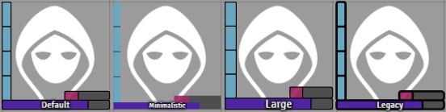
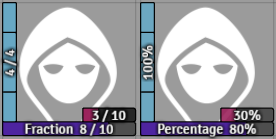
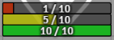
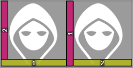
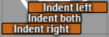
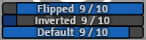
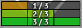
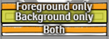
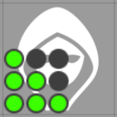

# FoundryVTT Bar Brawl

This is the repository of the resource bar addon for FoundryVTT.

## Usage

**Bar Brawl** allows an arbitrary amount of customizable resource bars for tokens.


The module replaces the menu found in *Token Configuration* > *Resources*. Here, you can add a new bar by clicking *Add resource*.

### Global settings

Users can define the basic appearence of bars from the module configuration.

#### Style

The bar style determines how the content of the bar itself is rendered, with four available options:



#### Label

The label style can be set to display numbers or percentages on the bars by default. Note that this can be overriden per bar by using the [advanced settings](#advanced-settings).



### Basic configuration

Each bar has some classic options that determine its behavior:

#### Attribute & Value

The bar's attribute determines which value is displayed. It is configured like FoundryVTT's resources, except that you can also set a *Custom* value (which allows you to use your own numbers rather than representing an actor attribute).

*Single Values* do not have a maximum value and can therefore not be represented by a bar. However, it is possible to enter a custom maximum value to display them as such.

#### Colors

The color pickers are used to select the minimum (bar is empty) and maximum (bar is full) color. In between the two, the color is determined by interpolating the hue in HSV space, e.g. the midway point between green and red is yellow.



In addition to the bar itself, the maximum color is also used as a border on the token HUD input.

#### Visibility

To hide bars in certain circumstances, use the visibility settings. The configuration allows separate settings for the owner of the token and everyone else. It is possible to always display a bar, never display it, display it only when the token is hovered or display it only when the token is selected (only available for the owner).

#### Position & Order

The position determines the side on which side the bar is drawn and whether it is inside or outside of the token's boundaries. Bars are always rendered according to the order in the configuration (which you can change using the arrow keys next to the bar's header element) from the token's edge, meaning outside-in for inner bars and inside-out for outer bars.

Bars that are higher up in the configuration will also claim any extra space on their sides, so the order matters even for inner bars that are not on the same side. For the following screenshot, the order was reversed: Notice how on the left, the yellow bar occupies the corner while on the right, the red bar claims the space.




### Advanced settings

Every bar has an *advanced configuration* that can be opened to change additional settings.

#### Indentation

With the identation values, you can add empty space to the left or right of the bar (for vertical bars, the space will be on the top and bottom). The value is in percent of the token's width (so while 100% is still valid, it'll display nothing). You can also set this to negative values to increase the width of the bar instead of reducing it.



#### Label & Prefix

The label option sets the displayed numbers per bar. By default, this is determined by the global user settings. For a list of options and what they do, see the [global configuration](#global-settings) section.

Setting a prefix will always display that text on the bar (the examples on this page were done this way), regardless of the configured label. If a numeric label is set, the numbers will be appended to the prefix.

#### Ignore limits

This option can be used to allow bars with a custom value (set in the attribute setting) to have a value less than 0 (lower limit) or higher than the maximum (upper limit). These out of bounds values will be displayed on the label, but not on the bar itself.

For other attributes, the system should handle the boundary values and the options are disabled.

#### Invert values

In order to represent "negative" resources such as wounds, you can invert the bar's values. This will display 0 as a full bar and the maximum value as an empty bar (and proportionally inbetween).



#### Approximation & Owner

Sometimes you may not want to share the exact value of the bar with all players. For this purpose, you can set the approximation to a number of segments, which will also be applied to the label (e.g. a 9/10 value with 3 segments displays 3/3). The value is rounded up, so the bar is only empty when it reaches 0 (or below).



By default, the owner of the token can still see the actual value of the resource. To change this, check the *Approximation for owner* box.

#### Images

Instead of drawing the usual styles, bars can instead have an image as foreground, background or both. When setting only setting a foreground image, no background is rendered and the size is determined from the image. When setting only a background, the normal foreground is drawn with the configured style across the entire height of the image. When both are set, the size is determined from the background and the foreground image is vertically centered on it.



It is recommended that your images are at most twice the size of the token grid (as defined in the scene's settings). User larger images will work, but may negatively impact performance.

#### Combinations

All of the options can be combined with each other to create highly customizable resource displays. For example, you could use images, indentation and approximation to create an ammunition display like this:

| Setting | Value |
| --- | --- |
| Indent right | 40% |
| Approximation | 3 |
| Approximation for owner | Yes |
| Label | None |
| Background image |  |
| Foreground image |  |

... to create this result:




## Development

Bar Brawl is purely data based, meaning that you can adjust everything by updating via Foundry and expect the changes to be applied automatically. The resource bar object is stored for each token in `Token.data.flags.barbrawl.resourceBars` and has the following format:

```javascript
{
    "aBarId": {
        id: "aBarId",
        attribute: "custom",
        ownerVisibility: CONST.TOKEN_DISPLAY_MODES.ALWAYS,
        otherVisibility: CONST.TOKEN_DISPLAY_MODES.NONE,
        value: 5,
        max: 5,
        mincolor: "#000000",
        maxcolor: "#FFFFFF",
        position: "bottom-inner",
        style: "user",
        ignoreMin: false,
        ignoreMax: false,
        invert: false,
        label: "",
        subdivisions: 0,
        subdivisionsOwner: false,
        intentLeft: 0,
        indentRight: 0,
        fgImage: "",
        bgImage: ""
    }
}
```

- The **attribute** is a string representing the data path of the target attribute, relative to the actor's data (for examples, open the attribute menu through the UI configuration). Unlinked bars have the attribute "custom" and additionally contain number fields for the current and maximum value.
- Valid **position**s are combinations of top/bottom/left/right and inner/outer, e.g. "bottom-inner".
- Valid **style**s are "user", "none", "fraction" and "percent" - this overrides the user setting, so you should generally prefer the "user" mode.
- The **visibility** properties can be 50, 30, 10 or 0 for always, hovered, controlled or never, respectively (see `CONST.TOKEN_DISPLAY_MODES`).
- Both **color**s are HTML color strings.
- The fields "**ignoreMin**" and "**ignoreMax**" are boolean flags that disable clamping of the bar's value.
- The **invert** flag is a boolean indicating whether a full value should be rendered as en empty bar.
- The **label** is prepended to the value label (determined by the style property).
- The **subdivisions** field is an integer that applies approximation to the bar's label. By default, it is not applied for the owner of the token, which can be changed using **subdivisionsOwner**.
- The **indent**s determine extra space before or after the bar and can be integers between -100 and 100 (although using a 100% indent will render nothing).
- Images for the foreground and background can be set to a relative file path (as emitted by FoundryVTT's file picker).

Bar Brawl also attempts to synchronize Foundry's default "bar1" and "bar2" properties. This means that these two strings are special IDs and should not be used unless you intend to maintain compatibility with a module using Foundry bars.

Here are some common examples of things you might want to do with the bars:

### Get all bar values of a token

The most basic access is through the `barbrawl.resourceBars` flag of the token:

```javascript
const token = new Token() // Pretend that this isn't empty
const resourceBars = foundry.utils.getProperty(token.document.data, "flags.barbrawl.resourceBars");
if (!resourceBars) return [];
return Object.values(resourceBars).map(bar => {
    if (bar.attribute === "custom") return bar.value;
    return token.document.getBarAttribute(null, { alternative: bar.attribute }).value;
});
```

Note that the values are only kept current for custom bars, which means that for any other attribute you have to resolve the value and its maximum yourself. When getting the maximum value, consider that the bar configuration may set a value that is not reflected on the resource (to display it as a bar even though it isn't).

### Spawn tokens with a custom bar

To create bars on tokens by default, add them during the `preCreateToken` hook:

```javascript
Hooks.on("preCreateToken", function (document, data) {
    document.data.update({
        "flags.barbrawl.resourceBars": {
            "bar1": {
                id: "bar1",
                mincolor: "#FF0000",
                maxcolor: "#80FF00",
                position: "bottom-inner",
                attribute: "attributes.hp",
                visibility: CONST.TOKEN_DISPLAY_MODES.OWNER
            }
        }
    });
});
```

**Important**: When creating your own bar ID, make sure that it starts with a letter to ensure HTML4 compatibility. For example, `randomID()` can create IDs that end up causing problems, so you should use something like `'b' + randomID()` instead.

Each user (with the appropriate permissions) may store his/her own default resource configuration that will override the previous hooks.

### Remove a bar

In order to get rid of a bar, either use Foundry's `-=key` syntax or set the attribute to an empty string.

```javascript
let barId = "b" + randomID(); // ID of the bar you intend to remove
token.document.update({ [`flags.barbrawl.resourceBars.${barId}.attribute`]: "" });

// Alternative:
token.document.update({ [`flags.barbrawl.resourceBars.-=${barId}`]: null });
```

### Modify the value of a custom bar

Simply fetch the bar from the data and update its value property:

```javascript
let barId = "b" + randomID(); // ID of the bar you intend to modify
token.document.update({ [`flags.barbrawl.resourceBars.${barId}.value`]: 5 });
```

This will not apply clamping, so whatever you set here is final.