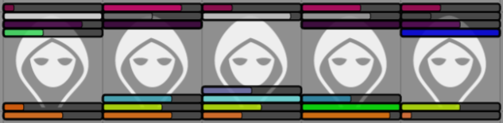

# FoundryVTT Bar Brawl

This is the repository of the resource bar addon for FoundryVTT.

## Usage

**Bar Brawl** allows an arbitrary amount of customizable resource bars for tokens.



The module replaces the menu found in *Token Configuration* > *Resources*. Here, you can add a new bar by clicking *Add resource*.

For each bar, there are several options:
- The **Attribute** controls the source of the displayed values. *None* will remove the bar, *Custom* allows setting your own numbers and every other entry represents an attribute of the actor.
- To show bars to other players (or hide them completely), change the **Visibility** setting.
- The current and maximum **Value** fields show the used numbers and can be changed for custom bars.
- Minimum and maximum **Color** values are interpolated between the two (depending on how full the bar is). The maximum color is also used for the border of the token's HUD inputs.
- The **Position** can be used to align bars at the top or bottom of the token (facing inwards or outwards).

## Development

Bar Brawl is purely data based, meaning that you can adjust everything by updating via Foundry and expect the changes to be applied automatically. The resource bar object is stored for each token in `Token.data.flags.barbrawl.resourceBars` and has the following format:

```javascript
{
    "aBarId": {
        id: "aBarId",
        attribute: "custom",
        value: 5,
        max: 5,
        mincolor: "#000000",
        maxcolor: "#FFFFFF",
        position: "bottom-inner",
        visibility: CONST.TOKEN_DISPLAY_MODES.OWNER
    }
}
```

Valid positions are "bottom-inner", "bottom-outer", "top-inner" and "top-outer". The visibility can be any of the standard Foundry display modes (`CONST.TOKEN_DISPLAY_MODES`). Both colors are HTML color strings. The attribute is a string representing the data path of the target attribute, relative to the actor's data (for examples, open the attribute menu through the UI configuration). Unlinked bars have the attribute "custom" and additionally contain number fields for the current and maximum value.

Bar Brawl also attempts to synchronize Foundry's default "bar1" and "bar2" properties. This means that these two strings are special IDs and should not be used unless you intend to maintain compatibility with a module using Foundry bars.

Here are some common examples of things you might want to do with the bars:

### Get all bar values of a token

The most basic access is through the `barbrawl.resourceBars` flag of the token:

```javascript
let token = new Token() // Pretend that this isn't empty
let resourceBars = getProperty(token.data, "flags.barbrawl.resourceBars");
if (!resourceBars) return [];
return Object.values(resourceBars).map(bar => {
    if (bar.attribute === "custom") return bar.value;
    return token.getBarAttribute(null, { alternative: bar.attribute }).value
});
```

Note that the values are only kept current for custom bars, which means that for any other attribute you have to resolve the value and its maximum yourself.

### Spawn tokens with a custom bar

To create bars on tokens by default, add them during the `preCreateToken` hook:

```javascript
Hooks.on("preCreateToken", function(_scene, data) {
    setProperty(data, "flags.barbrawl.resourceBars", {
        "bar1": {
            id: "bar1",
            mincolor: "#FF0000",
            maxcolor: "#80FF00",
            position: "bottom-inner",
            attribute: "attributes.hp",
            visibility: CONST.TOKEN_DISPLAY_MODES.OWNER
        }
    });
});
```

**Important**: When creating your own bar ID, make sure that it starts with a letter to ensure HTML4 compatibility. For example, `randomID()` can create IDs that end up causing problems, so you should use something like `'b' + randomID()` instead.

### Remove a bar

In order to get rid of a bar, either use Foundry's `-=key` syntax or set the attribute to an empty string.

```javascript
let barId = "b" + randomID(); // ID of the bar you intend to remove
token.update({ [`flags.barbrawl.resourceBars.${barId}.attribute`]: "" });

// Alternative:
token.update({ [`flags.barbrawl.resourceBars.-=${barId}`]: null });
```

### Modify the value of a custom bar

Simply fetch the bar from the data and update its value property:

```javascript
let barId = "b" + randomID(); // ID of the bar you intend to modify
token.update({ [`flags.barbrawl.resourceBars.${barId}.value`]: 5 });
```